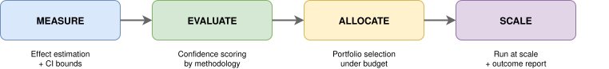

# Impact Engine — Orchestrator

[](https://github.com/eisenhauerIO/tools-impact-engine-orchestrator/actions/workflows/ci.yaml)
[](https://github.com/eisenhauerIO/tools-impact-engine-orchestrator/actions/workflows/docs.yml)
[](https://github.com/eisenhauerIO/tools-impact-engine-orchestrator/blob/main/LICENSE)
[](https://github.com/astral-sh/ruff)
[](https://join.slack.com/t/eisenhauerioworkspace/shared_invite/zt-3lxtc370j-XLdokfTkno54wfhHVxvEfA)

*Fan-out/fan-in pipeline runner for scaling pilot experiments to full deployment*

Running a single causal study is hard enough. Running a portfolio of pilots — measuring effects, scoring confidence, selecting winners, and validating at scale — means stitching together independent analysis steps, synchronizing results, and managing a fan-out/fan-in execution pattern. Most teams build this glue code from scratch for every engagement.

**Impact Engine — Orchestrator** wires the full MEASURE → EVALUATE → ALLOCATE → SCALE pipeline into one config-driven run. A YAML file defines your initiatives, budget, and component settings. The orchestrator fans out pilot measurements in parallel, collects confidence-scored results, runs portfolio selection, then scales the winners — producing an outcome report that compares predicted vs actual impact. Swap any pipeline component by changing one line in the config.

<p align="center">
  
</p>

## Quick Start

```bash
pip install git+https://github.com/eisenhauerIO/tools-impact-engine-orchestrator.git
```

```python
from impact_engine_orchestrator.config import load_config
from impact_engine_orchestrator.orchestrator import Orchestrator

config = load_config("pipeline.yaml")
orchestrator = Orchestrator.from_config(config)
results = orchestrator.run()
```

## Documentation

| Guide | Description |
|-------|-------------|
| [Pipeline](https://eisenhauerio.github.io/tools-impact-engine-orchestrator/pipeline/index.html) | Stage descriptions and data flow contracts |
| [Development](https://eisenhauerio.github.io/tools-impact-engine-orchestrator/development/index.html) | Quick start, project structure, configuration |
| [API Reference](https://eisenhauerio.github.io/tools-impact-engine-orchestrator/api/index.html) | Auto-generated class and function documentation |

## Component Repositories

| Component | Repository |
|-----------|------------|
| **MEASURE** | [tools-impact-engine-measure](https://github.com/eisenhauerIO/tools-impact-engine-measure) |
| **EVALUATE** | [tools-impact-engine-evaluate](https://github.com/eisenhauerIO/tools-impact-engine-evaluate) |
| **ALLOCATE** | [tools-impact-engine-allocate](https://github.com/eisenhauerIO/tools-impact-engine-allocate) |
| **SIMULATE** | [tools-catalog-generator](https://github.com/eisenhauerIO/tools-catalog-generator) |

## Development

```bash
hatch run test        # Run tests
hatch run lint        # Run linter
hatch run format      # Format code
hatch run docs:build  # Build documentation
```
